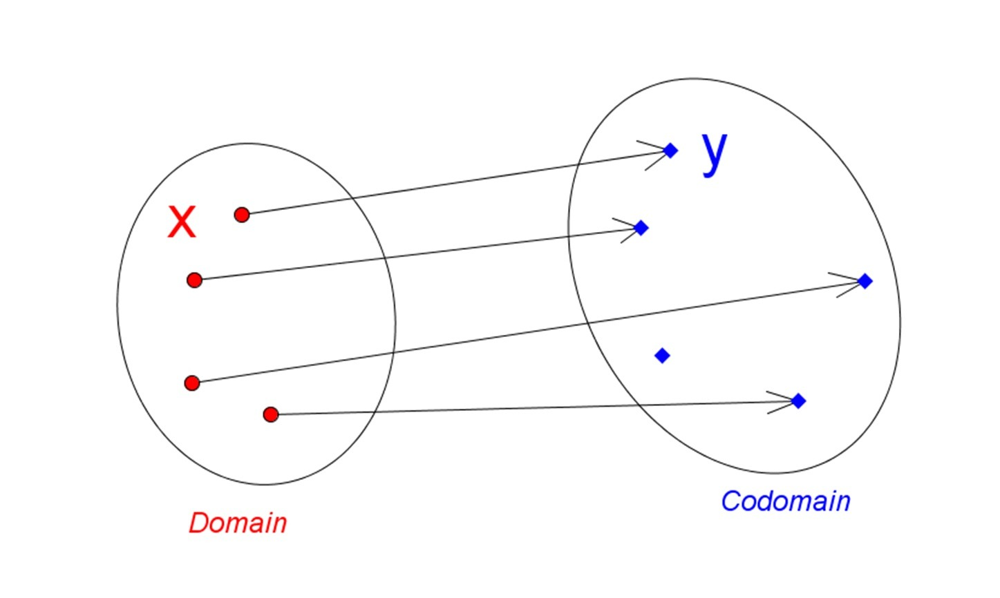

# Funzioni di prima classe

In un linguaggio funzionale, le funzioni sono **un qualcosa**, possono essere create, assegnate, passate come argomento o
ritornate da altre funzioni. Si dice dunque che le funzioni sono **cittadine di prima classe** in quanto ricoprono un ruolo significativo nella composizione dei nostri programmi, al pari delle variabili, dei valori e dei dati.

## Funzioni pure

Nei linguaggi orientati ad oggetti siamo soliti implementare metodi, procedure e funzioni nei nostri oggetti. Siamo quindi abituati a pensare alle **funzioni** come dei **contenitori di operazioni** che invocate **producono un qualche tipo di effetto** sul nostro sistema.

In programmazione funzionale, il concetto di funzione è molto più vicino a quello delle \*_funzioni matematiche_.
In matematica, una funzione è la rappresentazione di una relazione tra due insiemi di valori:



Nell'immagine qui sopra, ogni valore dell'insieme di sinistra è **mappato** ad un solo valore dell'insieme di sinistra. Questa è la rappresentazione di una funzione matematica.

Semplicamente una funzione **f** prende in ingresso un valore **x**, e restituisce il valore **y** corrispondente.

```:no-line-numbers
y = f(x)
```

Una funzione pura per ogni valore in input produce sempre lo stesso risultato in output. Più precisamente, si può dire che una funzione pura gode anche della proprietà di **trasparenza referenziale**, ovvero la sua invocazione può essere sostituita con il risultato della computazione senza alterare in alcun modo il comportamento del programma.

## Che cos'è un side effects?

Possiamo semplificare dicendo che, una funzione che ha un **side effect**, è una funzione che oltre a ritornare un valore, esegue una qualsiasi altra operazione.

Alcuni esempi di _side effect_ sono:

- modificare uno stato globale
- lanciare un'eccezione
- leggere o scrivere un file
- eseguire una richiesta di rete
- accedere ad uno stato globale

## Quiz

> Data **f** come funzione pura, qual'è il valore di **x** alla riga **3** ?

```
x = [1, 2, 3]
y = f(x)
x = ??
```

::: details Soluzione
Essendo una funzione pura, essa non può in alcun modo modificare il contesto ne lo stato del programma. Per cui il valore di **x** sarà immutato.

```:no-line-numbers
x = [1, 2, 3]
```

:::
